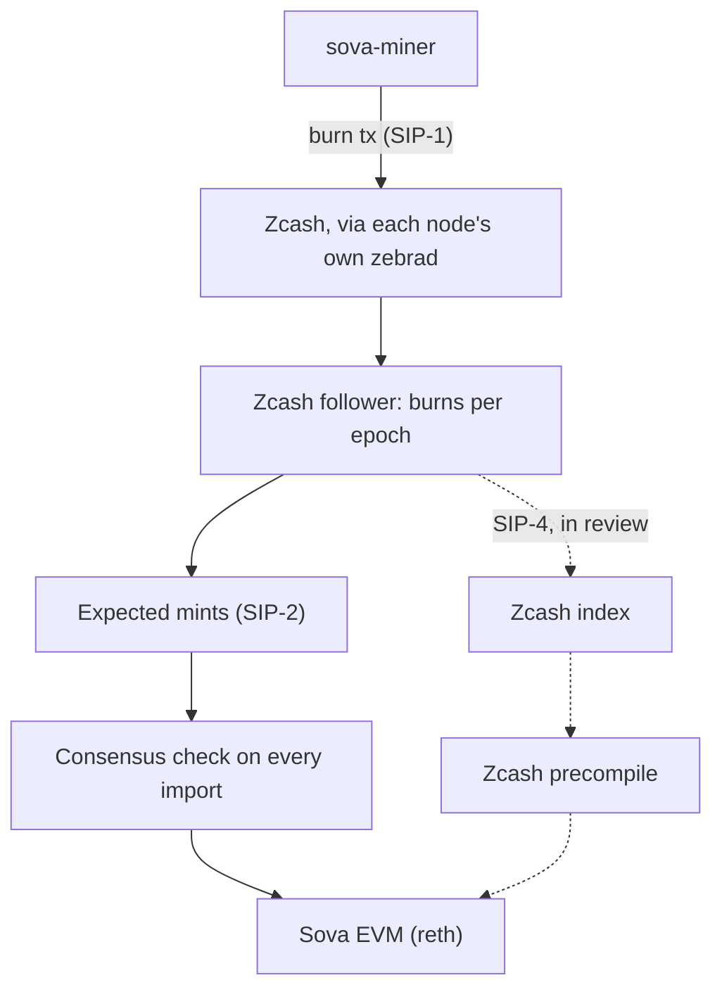

<p align="center">
  <picture>
    <source media="(prefers-color-scheme: dark)" srcset="brand/logo/sova-wordmark-gold.svg">
    <source media="(prefers-color-scheme: light)" srcset="brand/logo/sova-wordmark-deep-gold.svg">
    
  </picture>
</p>

<h3 align="center">The programmable edge of the shielded pool.</h3>

<p align="center">
  An EVM chain that can see Zcash. Mined by burning ZEC.
</p>

<p align="center">
  <a href="https://github.com/sova-chain/sova/actions/workflows/ci.yml"></a>
  <a href="#license"></a>
</p>

<p align="center">
  <a href="https://sova.io">sova.io</a> ·
  <a href="#quickstart">Quickstart</a> ·
  <a href="sips/">SIPs</a> ·
  <a href="docs/ROADMAP.md">Roadmap</a> ·
  <a href="SECURITY.md">Security</a>
</p>

---

Sova is an EVM chain that can see Zcash: contracts verify real ZEC payments
on Zcash itself. SOVA, the gas token, is mined by burning ZEC, one Sova block
per Zcash block. Every node verifies every mint against its own Zcash node.
Permissionless, oracle-less, self-custody.

> **Status: pre-release and unaudited.** Sova runs today as a local devnet
> (`./box/up.sh`); a public testnet, mined with testnet ZEC, is next
> ([roadmap](docs/ROADMAP.md)). Read [`SECURITY.md`](SECURITY.md) before
> relying on it, and to report a vulnerability.

## Quickstart

Run a full local burn-to-mine devnet (a Zcash regtest node, a Sova node and a
miner) with one command. You need Docker running, and a Rust toolchain while
the first run builds from source. Details in [`box/README.md`](box/README.md).

```bash
git clone https://github.com/sova-chain/sova && cd sova
./box/up.sh          # up; the first run gets the node and miner binaries
./box/up.sh status   # block height, the miner's SOVA balance, settled epochs
./box/up.sh down     # clean teardown
```

How long the first run takes depends on where the binaries come from. From a
checkout of a tagged release, it downloads prebuilt binaries and the box is
mining in under a minute. No release is tagged yet, so today the first run
builds from source: about 11 minutes on an idle Apple Silicon laptop, up to
about 25 on a busy one. Later runs reuse the binaries and take under a
minute.

## How it works

- **Burn to mine.** A burn is one transparent Zcash transaction that pays ZEC
  to a provably unspendable script and names the EVM address to credit
  ([SIP-1](sips/sip-1.md)). Burning is the only way SOVA is issued.
- **One Zcash block, one Sova block.** Each Zcash block is an epoch, so
  Zcash's proof-of-work orders Sova. Burners rank by burn weight, and the top
  burner seals the block ([SIP-2](sips/sip-2.md)).
- **Exact mints.** Each epoch's reward is a 10% sealer tip plus a pool split
  pro rata by burn weight, paid as the block's withdrawals; the shares always
  sum to the full reward. [SIP-3](sips/sip-3.md) sets the schedule: 6,250
  SOVA per epoch after a 20,000-epoch slow start, halving every 1,680,000
  epochs.
- **Every node checks every mint.** Each node runs its own `zebrad`,
  re-derives every mint from it, and rejects blocks that disagree, on every
  import path, including the history a new node syncs.
- **Contracts that see Zcash.** The SIP-4 precompile answers questions about
  transparent Zcash state (is this transaction mined, how deep, what does
  this output pay) as of the Zcash block each Sova block commits to, so every
  node computes the same answer. Shielded data stays shielded. *Code in
  review; ships with the public testnet.*



## Sova Improvement Proposals

Protocol changes go through SIPs, in [`sips/`](sips/).

| SIP | Title | Status |
| --- | --- | --- |
| [SIP-1](sips/sip-1.md) | The Burn Transaction Format | Frozen |
| [SIP-2](sips/sip-2.md) | Epochs, Rewards, and Settlement | Draft: implemented, proven on regtest |
| [SIP-3](sips/sip-3.md) | Emission Schedule | Accepted |
| [SIP-4](sips/sip-4-draft-zcash-state-precompile.md) | Zcash State Precompile | Draft: build approved, code in review |
| [SIP-5](sips/sip-5-withdrawn.md) | Wrapped ZEC | Withdrawn: a Sova Labs product (wz.cash), not a protocol rule |
| [SIP-6](sips/sip-6-draft-sealer-signatures.md) | Sealer Signatures | Accepted: implementation pending |
| [SIP-7](sips/sip-7-draft-zcash-events.md) | Zcash Pool State and Events | Accepted: implementation pending |

## Repository layout

| Path | Purpose |
| --- | --- |
| `crates/chainspec` | Sova chain constants, genesis configuration |
| `crates/consensus` | Burn-to-mine consensus client: Zcash follower, burn parser, sealer, gossip |
| `crates/engine` | Sova Engine API payload/node types |
| `crates/evm` | Sova EVM extensions: settlement transactions, Zcash query precompile |
| `crates/burn-wallet` | Transparent-only Zcash burn transaction builder, `sova-miner` CLI, TAZ faucet (a separate workspace) |
| `crates/miner` | Miner daemon logic shared by CLI and MCP |
| `bin/sova` | Sova node binary |
| `bin/sova-miner` | Sova miner CLI binary |
| `box` | sova-in-a-box: one-command local devnet ([`box/README.md`](box/README.md)) |
| `contracts` | Day-one dapp kit (Foundry): WSOVA, Uniswap-V2-class AMM, Multicall3, Ashwings (10,000 owls, SOVA or ZEC) and its market |
| `mcp` | MCP server wrapping the miner CLI |
| `sips` | Sova Improvement Proposals (protocol specs) |
| `docs` | Roadmap, design notes, operator runbooks |
| `site` | Project website ([sova.io](https://sova.io)) |
| `brand` | Logos and brand kit ([`brand/readme.md`](brand/readme.md)) |

## Contributing

See [`CONTRIBUTING.md`](CONTRIBUTING.md). Protocol changes start as a SIP;
changes to consensus code need simulation-harness coverage
([`box/sim`](box/sim/README.md)).

## Security

Report vulnerabilities privately, never in a public issue: see
[`SECURITY.md`](SECURITY.md).

## License

Licensed under either of [Apache License, Version 2.0](LICENSE-APACHE) or
[MIT license](LICENSE-MIT) at your option, **except** third-party code that
keeps its own license. Most notably, the vendored Uniswap V2 contracts in
`contracts/src/vendor/{v2-core,v2-periphery,uniswap-lib}` are **GPL-3.0**,
and the AMM contracts the dapp kit deploys are compiled from that GPL-3.0
source. See [`NOTICE`](NOTICE) for the full list and
[`contracts/src/vendor/README.md`](contracts/src/vendor/README.md) for
provenance and the one modification.

<p align="center"><a href="https://sova.io">sova.io</a></p>
