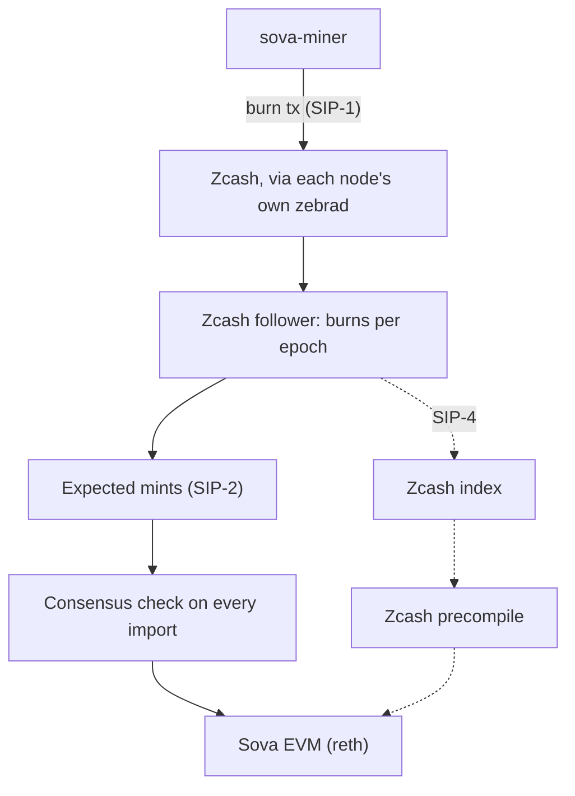

<p align="center">
  <picture>
    <source media="(prefers-color-scheme: dark)" srcset="brand/logo/sova-wordmark-gold.svg">
    <source media="(prefers-color-scheme: light)" srcset="brand/logo/sova-wordmark-deep-gold.svg">
    
  </picture>
</p>

<h3 align="center">The EVM that reads Zcash.</h3>

<p align="center">
  Mined by burning ZEC.
</p>

<p align="center">
  <a href="https://github.com/sova-chain/sova/actions/workflows/ci.yml"></a>
  <a href="#license"></a>
</p>

<p align="center">
  <a href="https://sova.io">sova.io</a> ·
  <a href="https://docs.sova.io">Docs</a> ·
  <a href="docs/guides/testnet.md">Join the testnet</a> ·
  <a href="#run-it-locally">Run it locally</a> ·
  <a href="sips/">SIPs</a> ·
  <a href="docs/ROADMAP.md">Roadmap</a> ·
  <a href="SECURITY.md">Security</a>
</p>

---

Sova is an EVM chain that runs beside Zcash. Every Sova node runs its own
Zcash node, so contracts can check real ZEC payments and every node checks
every mint. SOVA, the gas coin, is minted only by burning ZEC. One Sova block
follows each Zcash block. Every SOVA begins as ZEC burned for good. Sova's
footprint on Zcash is the burns, at Zcash's normal fee.

> **Status: pre-release and unaudited.** The public testnet runs on Zcash
> testnet, so mining costs only testnet ZEC. Read [`SECURITY.md`](SECURITY.md)
> before relying on it, and to report a vulnerability.

## Get started

- **Join the public testnet.** Run a node and mine with testnet ZEC:
  [the join guide](docs/guides/testnet.md). Chain ID 82330. Look around first
  in the [explorer](https://explorer.testnet.sova.io); get testnet ZEC from
  the [faucet](https://faucet-testnet.sova.io); public RPC
  `https://rpc-testnet.sova.io`.
- **Run it locally.** One command starts a private Zcash regtest node, a Sova
  node and a miner ([below](#run-it-locally)).
- **Read the specs.** The protocol is written down as SIPs in
  [`sips/`](sips/) ([list below](#sova-improvement-proposals)).

## Run it locally

You need Docker running. Clone the latest release tag, so the box can
download prebuilt binaries (Linux x86_64 and Apple Silicon):

```bash
git clone --branch v0.1.14 https://github.com/sova-chain/sova && cd sova
./box/up.sh          # up; mining in under a minute with prebuilt binaries
./box/up.sh status   # block height, the miner's SOVA balance, settled epochs
./box/up.sh down     # clean teardown
```

On other platforms, or from an untagged checkout, the first run builds from
source with a Rust toolchain: about 11 minutes on an idle Apple Silicon
laptop, up to 25 on a busy one. Details in [`box/README.md`](box/README.md).

## How it works

- **Burn to mine.** A burn is one transparent Zcash transaction that pays ZEC
  to a provably unspendable script and names the EVM address to credit
  ([SIP-1](sips/sip-1.md)). Burning is the only way SOVA is issued.
- **One Zcash block, one Sova block.** Each Zcash block is an epoch, so
  Zcash's proof-of-work orders Sova. Burners rank by burn weight, and the top
  burner seals the block ([SIP-2](sips/sip-2.md)).
- **Exact mints.** Each epoch's reward is a 10% sealer tip plus a pool split
  pro rata by burn weight, paid as the block's withdrawals; the shares always
  sum to the full reward. [SIP-3](sips/sip-3.md) sets the schedule:
  2,083.33332 SOVA per 25-second epoch after a 60,000-epoch slow start,
  halving every 5,040,000 epochs (about four years).
- **Every node checks every mint.** Each node runs its own `zebrad`,
  re-derives every mint from it, and rejects blocks that disagree, on every
  import path, including the history a new node syncs.
- **Contracts that read Zcash.** The SIP-4 precompile answers questions about
  transparent Zcash state (is this transaction mined, how deep, what does
  this output pay) as of the Zcash block each Sova block commits to, so every
  node computes the same answer. Shielded data stays shielded. *Live on the
  public testnet.*


```mermaid
flowchart TD
  miner["sova-miner"] -- "burn tx (SIP-1)" --> zebrad["Zcash, via each node's own zebrad"]
  zebrad --> follower["Zcash follower: burns per epoch"]
  follower --> expect["Expected mints (SIP-2)"]
  expect --> consensus["Consensus check on every import"]
  consensus --> evm["Sova EVM (reth)"]
  follower -. "SIP-4" .-> index["Zcash index"]
  index -.-> precompile["Zcash precompile"]
  precompile -.-> evm
```

## Sova Improvement Proposals

Protocol changes go through SIPs, in [`sips/`](sips/).

| SIP | Title | Status |
| --- | --- | --- |
| [SIP-1](sips/sip-1.md) | The Burn Transaction Format | Frozen |
| [SIP-2](sips/sip-2.md) | Epochs, Rewards, and Settlement | Draft: live on the testnet |
| [SIP-3](sips/sip-3.md) | Emission Schedule | Accepted |
| [SIP-4](sips/sip-4-draft-zcash-state-precompile.md) | Zcash State Precompile | Draft: build approved, live on the testnet |
| [SIP-6](sips/sip-6-draft-sealer-signatures.md) | Sealer Signatures | Accepted: live on the testnet |
| [SIP-7](sips/sip-7-draft-zcash-events.md) | Zcash Pool State and Events | Accepted: live on the testnet |
| [SIP-8](sips/sip-8-draft-anchored-burns.md) | Anchored Burns | Accepted: not active on any network yet |

## Repository layout

| Path | Purpose |
| --- | --- |
| `crates/chainspec` | Sova chain constants, genesis configuration |
| `crates/consensus` | Burn-to-mine consensus client: Zcash follower, burn parser, sealer, gossip |
| `crates/engine` | Sova Engine API payload/node types |
| `crates/evm` | Sova EVM extensions: settlement transactions, Zcash query precompile |
| `crates/burn-wallet` | Transparent-only Zcash burn transaction builder, `sova-miner` CLI, TAZ faucet (a separate workspace) |
| `crates/miner` | Miner daemon logic shared by CLI and MCP |
| `bin/sova` | Sova node binary |
| `bin/sova-miner` | Sova miner CLI binary |
| `box` | sova-in-a-box: one-command local devnet ([`box/README.md`](box/README.md)) |
| `contracts` | Day-one dapp kit (Foundry): WSOVA, Uniswap-V2-class AMM, Multicall3, Ashwings (10,000 owls, SOVA or ZEC) and its market |
| `mcp` | MCP server wrapping the miner CLI |
| `sips` | Sova Improvement Proposals (protocol specs) |
| `docs` | Roadmap, design notes, operator runbooks |
| `site` | Project website ([sova.io](https://sova.io)) |
| `brand` | Logos and brand kit ([`brand/readme.md`](brand/readme.md)) |

## Community

- Telegram: [t.me/sovazec](https://t.me/sovazec)
- X: [x.com/sovazec](https://x.com/sovazec)

## Contributing

See [`CONTRIBUTING.md`](CONTRIBUTING.md). Protocol changes start as a SIP;
changes to consensus code need simulation-harness coverage
([`box/sim`](box/sim/README.md)).

## Security

Report vulnerabilities privately, never in a public issue: see
[`SECURITY.md`](SECURITY.md).

## License

Licensed under either of [Apache License, Version 2.0](LICENSE-APACHE) or
[MIT license](LICENSE-MIT) at your option, **except** third-party code that
keeps its own license. Most notably, the vendored Uniswap V2 contracts in
`contracts/src/vendor/{v2-core,v2-periphery,uniswap-lib}` are **GPL-3.0**,
and the AMM contracts the dapp kit deploys are compiled from that GPL-3.0
source. See [`NOTICE`](NOTICE) for the full list and
[`contracts/src/vendor/README.md`](contracts/src/vendor/README.md) for
provenance and the one modification.

<p align="center"><a href="https://sova.io">sova.io</a></p>
